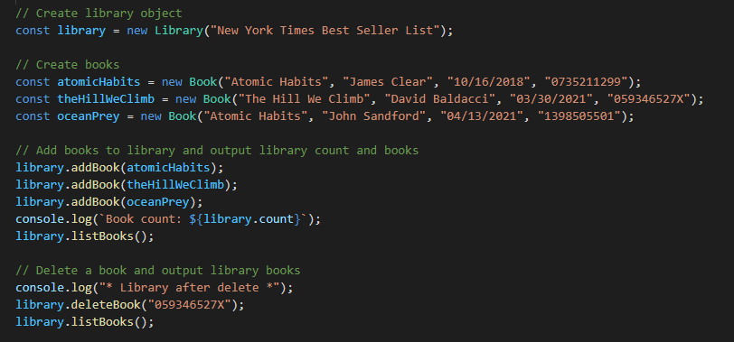
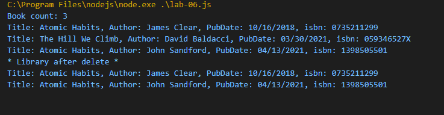

# Welcome to the Cit 281 Lab 6 Page

### What I learned:

- Introduction to classes in javascript.
- Creating functions within classes and calling those functions.
- Outputing code using classes.

### Purpose of Lab:

- This lab introduced us to classes, along with syntax used to code classes.
- We created classes, along with functions within the classes that can be ran and called for different outputs.
- We learned that an array can be edited with classes.

### Outcome pics: 

### [**Back to home page**](https://uo-cit-itsbread33.github.io/ItsBread33.github.io/)
